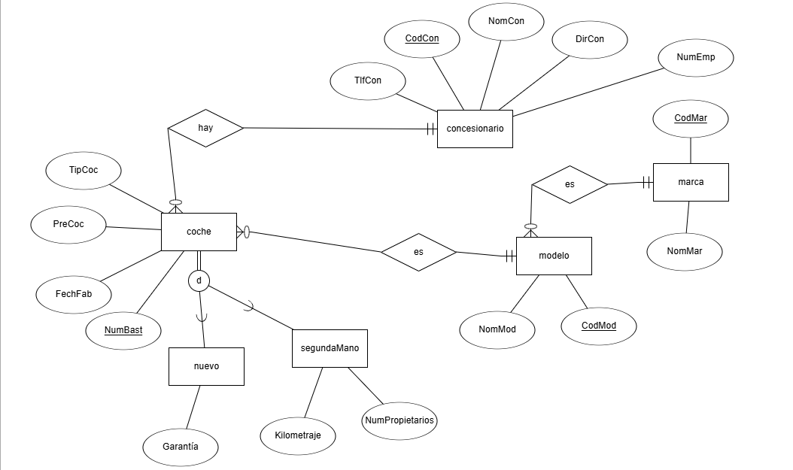

Base de datos de un concesionario

Tablas y columnas:
1- Concesionario: código (PK)(int)(NN), nombre(VARCHAR 250)(NN), dirección(VARCHAR 250)(NN), numero de empleados(int)(NN), numero de coches(int)(NN), TlfCon VARCHAR(15)(NN)
2- Coche: modelo (FK)(int)(NN), numero bastidor (PK)(int)(NN), CodCon(FK)(NN), FechFab (DATE) (NN), PreCoc (INT)(NN), TipCoc VARCHAR(45)(NN)
3- Modelo: nombre(VARCHAR 250)(NN), código (PK)(int)(NN), marca (FK)(itn)(NN)
4- Marca: nombre(VARCHAR 250)(NN), código (PK)(int)(NN)
5-Nuevo: Garantía (INT)(NN), NumBast(INT)(NN)(FK)
6-Segunda mano: kilometraje (INT)(NN), NumPropietarios (INT)(NN), NumBast (INT)(NN)(FK)

Acciones:
Añadir concesionario(Objeto tipo concesionario)(Que no se repita el código), borrar concesionario(comprobar que exista el concesionario)(codigo de concesionario), modificar concesionario(codigo de concesionario y objeto de la clase concesionario)(controlar que existe el concesionario y el codigo es único)

Añadir coche a concesionario (codigo de concesionario y objeto tipo coche)(controlando que exista el concesionario), eliminar coche del concesionario (codigo de concesionario y código de coche)(controlando que exista y el coche esté en el concesionario), modificar coche del concesionario (código de coche y objeto de la clase coche)(controlando que exista el coche)

Añadir marca (objeto tipo marca)(Controlar que no exista el codigo antes), modificar marca (codigo y objeto tipo marca)(Controlar que exista la marca y no exista el codigo nuevo) eliminar marca (Codigo) (Verificar que exista la marca y no tenga modelos asociados a ella)

Añadir modelo (objeto tipo modelo)(Controlar que no exista el codigo antes), modificar modelo (codigo y objeto tipo modelo)(Controlar que exista el modelo y no exista el codigo nuevo) eliminar modelo (Codigo) (Verificar que exista el modelo y no tenga coches asociados a el)

A tener en cuenta:
Cuando se borre un concesionario, se borra los coches que hay en él, cuando se borra un coche, no lo hace el concesionario, pueden haber concesionarios sin coche pero no coches sin concesionario, ninguna pk ni fk puede ser nula, un coche puede ser de dos tipos, o nuevo o de segunda mano, pero si o si debe de ser de algún tipo. Para que un concesionario funcione no hace falta que tenga empleados, podemos tener concesionarios nuevos sin empleados 

CREATE DATABASE Concesionario;
USE Concesionario;

CREATE TABLE concesionario
(
CodCon INT NOT NULL,
NumEmp INT NOT NULL,
NomCon VARCHAR(100) NOT NULL,
DirCon VARCHAR(100) NOT NULL,
TlfCon VARCHAR(15) UNIQUE NOT NULL,
PRIMARY KEY (CodCon)
);

CREATE TABLE marca
(
CodMar INT NOT NULL,
NomMar VARCHAR(15) NOT NULL,
PRIMARY KEY (CodMar)
);

CREATE TABLE modelo
(
CodMod INT NOT NULL,
NomMod VARCHAR(15) NOT NULL,
CodMar INT NOT NULL,
PRIMARY KEY (CodMod),
FOREIGN KEY (CodMar) REFERENCES marca(CodMar)
ON DELETE CASCADE
ON UPDATE CASCADE
);
CREATE TABLE coche
(
NumBast INT NOT NULL,
FechFab DATE NOT NULL,
PreCoc INT NOT NULL,
TipCoc VARCHAR(45) NOT NULL,
CodCon INT NOT NULL,
CodMod INT NOT NULL,
PRIMARY KEY (NumBast),
FOREIGN KEY (CodCon) REFERENCES concesionario(CodCon)
ON DELETE CASCADE
ON UPDATE CASCADE,
FOREIGN KEY (CodMod) REFERENCES modelo(CodMod)
ON DELETE CASCADE
ON UPDATE CASCADE
);
CREATE TABLE nuevo
(
Garantia INT NOT NULL,
NumBast INT NOT NULL,
PRIMARY KEY (NumBast),
FOREIGN KEY (NumBast) REFERENCES coche(NumBast)
ON DELETE CASCADE
ON UPDATE CASCADE
);
CREATE TABLE segundaMano
(
kilometraje INT NOT NULL,
NumPropietarios INT NOT NULL,
NumBast INT NOT NULL,
PRIMARY KEY (NumBast),
FOREIGN KEY (NumBast) REFERENCES coche(NumBast)
ON DELETE CASCADE
ON UPDATE CASCADE
);

Algunos inserts
INSERT INTO concesionario (CodCon, NumEmp, NomCon, DirCon, TlfCon) 
VALUES 
(1, 10, 'Concesionario Madrid', 'Calle Alcalá, 123', '912345678'),
(2, 5, 'Concesionario Barcelona', 'Avenida Diagonal, 456', '932165487'),
(3, 8, 'Concesionario Valencia', 'Calle Colón, 789', '963852741');

INSERT INTO marca (CodMar, NomMar) 
VALUES 
(1, 'Toyota'),
(2, 'Ford'),
(3, 'BMW'),
(4, 'Audi');

INSERT INTO modelo (CodMod, NomMod, CodMar) 
VALUES 
(1, 'Corolla', 1),
(2, 'Mustang', 2),
(3, 'X5', 3),
(4, 'A4', 4);

INSERT INTO coche (NumBast, FechFab, PreCoc, TipCoc, CodCon, CodMod) 
VALUES 
(1001, '2020-01-15', 25000, 'Nuevo', 1, 1),
(1002, '2019-05-20', 45000, 'Segunda Mano', 2, 2),
(1003, '2021-03-10', 60000, 'Nuevo', 3, 3),
(1004, '2018-11-30', 35000, 'Segunda Mano', 1, 4);

INSERT INTO nuevo (Garantia, NumBast) 
VALUES 
(3, 1001),
(2, 1003);

INSERT INTO segundaMano (kilometraje, NumPropietarios, NumBast) 
VALUES 
(50000, 2, 1002),
(80000, 3, 1004);
